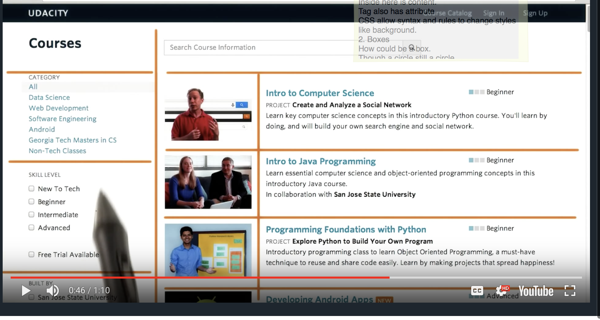
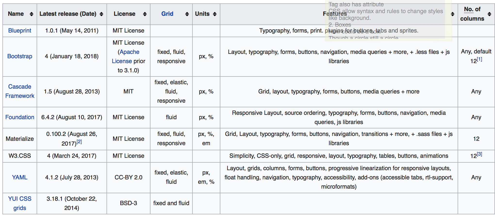

## Welcome to Udacity Projects Repository
This respository is to store the code of this whole learning period in [github](https://github.com/ZhangDubhe/Udacity-FrontEndDeveloper).

 In Core Curriculum, totally in 5 PARTS and with 9 PROJECTS.
### Here is the Syllabus:
#### PART 1 Web Foundations
In Web Foundations you'll learn about the Web and its central technologies. You'll learn about the foundational structure of all websites, HTML. You'll build on top of a website's structure with CSS to create beautifully designed sites. Finally, you'll learn to how to develop a web project like a professional using the version control tool, Git. You'll build three projects, and each project should take roughly one or two afternoons to complete from start to finish.

-   1.Project: Establishing Developer Mindset
-   2.Project: Mockup to Article
-   3.Project: Animal Trading Cards
_Estimated time: 29 days_

#### PART2 Responsive Websites
-   4.Project: Build a Portfolio Site
_Estimated time: 22 days_

#### PART 3 JavaScript Foundations
In JavaScript Foundations, you'll learn the most popular programming language in the world - JavaScript! You'll learn the basics of the language and then take the next step by looking at the popular JavaScript library, jQuery. You will write JavaScript code to programmatically generate your resume, leveraging JavaScript to add content to a resume template composed of HTML and CSS.

-   5.Project: Online Resume
_Estimated time: 29 days_

#### PART 4 Intermediate JavaScript
After laying a solid foundation with JavaScript basics, you're going to jump to the next level in your JavaScript skills. You'll learn all about Object-Oriented JavaScript techniques, closure, and the infamous "this" keyword. You'll also jump back into HTML by learning about the Canvas element. Using all of these skills, you'll create your own version of a classic arcade game.

-   6.Project: Classic Arcade Game Clone
_Estimated time: 43 days_

#### PART 5 Advanced Interactive Websites
In this unit, you'll learn how to take an already great website and optimize it for speed and efficiency. You'll learn about optimizing the Critical Rendering Path to help battle "jank" in your sites. You'll learn how to use APIs to send and retrieve data. You'll build organized, professional code using the MV* frameworks KnockoutJS and BackboneJS. You'll test your skills by optimizing a website that has some rendering problems. You'll also harness the power of the Google Maps API to create a neighborhood map application.

-   7.Project: Website Optimization
-   8.Project: Neighborhood Map
-   9.Project: Feed Reader Testing
_Estimated time: 3 months_

So I created this page to link every project in this nanodegree learning period I have done.

Keep a good habit for studying.

### Markdown
```markdown
Syntax highlighted code block

# Header 1
## Header 2
### Header 3

- Bulleted
- List

1. Numbered
2. List

**Bold** and _Italic_ and `Code` text

[Link](url) and 
```
For more details see [GitHub Flavored Markdown](https://guides.github.com/features/mastering-markdown/).

### Project 1. Establishing Developer Mindset
Hard to write an essay about this. Besides, there is also no code to show.

### Project 2. Mockup to article
Use basement semantic tag to mock up an article rather than only div. Only div tags seems like very boring.
There is one project name [MOCKUP-TO-ARTICLE](./mockup-to-article/) is doing this.
Besides, [DIV-SOUP-CLEANUP](./DIV-SOUP-CLEANUP/)is also an exersics about this.
To make the page easier on SEO, remember to use semantic tags make more.

To learn markdown, here also records some grammar about the md file.

### Project 3.Animal trading Cards
- Use what you've learned about CSS to convert a design prototype into a functional webpage!

Have fun and be creative 🐠 🐍 🐅 🐼 🐫 ! Writing CSS isn't an exact science, so feel free to experiment. For example, you might want to add rounded corners or a background color to your card. Your submission should resemble the design prototype, but it's okay if it doesn't match exactly, so long as you satisfy all the requirements.

Here is Demo page.[link](./fend-animal-trading-cards-master/card.html)


_originly wrote at University of Alberta, 2018.3.30_

## Note in the learning process
### CODING QUICKLY
#### key
Use the shortcut, and remember in specific text editor.

### HTML, CSS and BOXES
#### 1. Html and dom
*   HTML  - tag
*   Dom - elements in tree
Element is created between in tags.Inside here is content.

Tag also has attribute.CSS allow syntax and rules to change styles like background.

#### 2. Boxes
How could be a box.Though a circle still a circle. No matter what type of website, we can all design in box.

用盒子思想去构建网页。

Boxes to html. In exercise "Create Folder and File Structure", 

>  the Udacity Front-End Web Developer Style Guide recommends omitting `type="text/css" `from the tag. The correct link tag coding is: 

```css
<link rel="stylesheet" href="style.css">
```
Understant css -- **CSS - csacading style sheets**

Keep going down and down and until to the most specific rule of this element.

#### 3. HOW TO select the element in css
```css
/* tag */
p {
    
}
/* class */
.description {

}
/* id */
#id {

}
```
Absolute width and height in pixel have a bad user experience.

Code, Test, and Refine
1.  Look for the natural box. -- structure
2.  Look for repeated styles of semantic elements
3.  Write html
4.  Apply styles ( from BIGGEST to smallest ) **What's this?**
5.  Fix things


#### Review
这节课给人的总体印象不太好，课程内容逻辑性不强，从Box跳到Dom又跳回box，然后又是css的一些零碎内容。很难形成系统性的知识。

个人觉得学习CSS的基础十分重要，是能够保持代码规范性的重要因素。需要认真对待。

### CSS Framework & Response layout
Small [demo](portfolio/featured-work/) of this topic. 
#### grid layout
A good example from udacity in a regular grid layout.


#### Framework
-   Collections of CSS classes, that make page layout easy to implement
> CSS frameworks are pre-prepared software frameworks that are meant to allow for easier, more standards-compliant web design using the Cascading Style Sheets language. Most of these frameworks contain at least a grid.


Bootstrap: http://getbootstrap.com/ 
Foundation: http://foundation.zurb.com/ 
Yaml: http://www.yaml.de/ 
960 Grid: http://960.gs/ 
Susy: http://susy.oddbird.net/ 

Difference between BS3 and BS4:
response image:
.img-response & .img-fluid

#### Responsive
On desktop **width**
-   Previous 
    1024px or 1200px
-   Now 
    1920px or 1440px
-   Content
    Max as 960px is very common.

Most important key:
-   width : percentage
-   Use overflow to make sure the text can scroll
-   Empty space between each column.
-   Use media query to decide width of different device.

Tips:
-   tuning: http://placehold.it/ like:`http://via.placeholder.com/350x150`


